<h3><code>eric@github ~ $ ./contributions.sh</code></h3>

  

---

## 🚀 Tecnologias

### 💻 Desenvolvimento

    
    
    
    
    
    
    
    
    
    
    
    
    

 
 

### 🗄️ Banco de Dados

 
 

### 🛠️ Infraestrutura / DevOps / Observabilidade / Segurança

 
 

---

## 📌 Conhecimentos Práticos

- Desenvolvimento e consumo de **APIs REST**
- **Integrações** entre sistemas
- Automações de rotinas operacionais
- **CI/CD** com Git
- Testes automatizados com **Vitest**
- Deploy e gerenciamento com **PM2**
- Containers com **Docker**
- Reverse Proxy com **Nginx**
- Monitoramento e observabilidade com **Grafana**, **Loki** e **Zabbix**
- Detecção e mitigação de ameaças com **CrowdSec**
- Administração de ambientes **Linux** e **Windows Server**
- Consultas, tuning e manutenção em **SQL** (MySQL / PostgreSQL)
- Documentação de APIs com **Swagger**

---

## 📊 Estatísticas

  

  

 
 
 
 
 
 
 
 

---

## 📫 Contato

- GitHub: https://github.com/EricTeixeir  
- LinkedIn: https://www.linkedin.com/in/eric-teixeira-almeida/  
- E-mail: ericteixeiradealmeida@gmail.com
